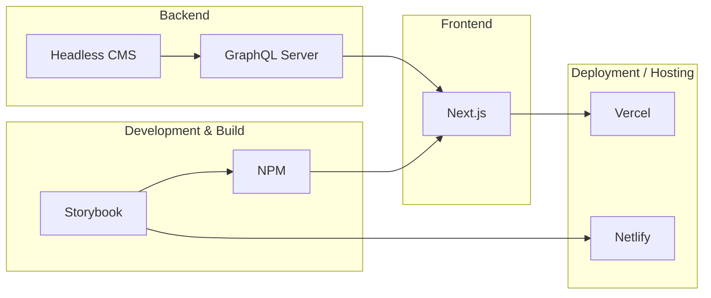

# Personal Portfolio Website

[](https://nextjs.org/)
[](https://www.typescriptlang.org/)

A modern, responsive personal portfolio website built with Next.js, TypeScript, and CSS Modules.

## 📖 Description

This project is a personal portfolio website built to showcase my skills and projects to potential employers and collaborators. It features a clean, minimalist design with strong attention to user experience and performance. The site is fully responsive and optimized for all devices.

A key highlight of this project is the reusable UI component library I developed from scratch. This library not only ensures consistency and scalability within the portfolio itself, but is also flexible enough to be reused across different applications. By making the UI foundation modular and extensible, the website demonstrates practices that scale well to larger projects and team-based development.

---

---

## ✨ Architecture



---

## 📸 Screenshots

_(Add screenshots of your project here. For example:)_
| Home Page | About Page |
|---|---|
|  |  |

---

## 🚀 Features

- **Custom Component Library:** The UI is built with a custom React
- **Responsive Design:** The layout adapts to different screen sizes.
  component library, `@krnjs/react-ui`.

---

## 🛠️ Tech Stack

- **Framework:** [Next.js](https://nextjs.org/)
- **Language:** [TypeScript](https://www.typescriptlang.org/)
- **Styling:** [CSS Modules](https://github.com/css-modules/css-modules)
- **UI Components:** [@krnjs/react-ui](https://www.npmjs.com/package/@krnjs/react-ui) (custom library)
- **Linting:** [ESLint](https.eslint.org/)
- **Deployment:** [Vercel](https://vercel.com/)

---

## ⚙️ Getting Started

### Prerequisites

- [Node.js](https://nodejs.org/en/) (v18.x or later)
- [npm](https://www.npmjs.com/)

### Installation

1.  Clone the repository:
    ```bash
    git clone git@github.com:keigokudo/portfolio.git
    ```
2.  Navigate to the project directory:
    ```bash
    cd portfolio
    ```
3.  Install the dependencies:
    ```bash
    npm install
    ```

### Running the Development Server

To start the development server, run the following command:

```bash
npm run dev
```

Open [http://localhost:3000](http://localhost:3000) in your browser to see the result.

---

## 📁 Project Structure

```
/
├── public/              # Static assets
├── src/
│   ├── app/             # Next.js App Router
│   │   ├── components/  # Shared components
│   │   ├── layout.tsx   # Root layout
│   │   └── page.tsx     # Home page
│   └── ...
├── next.config.ts       # Next.js configuration
├── package.json         # Project dependencies and scripts
└── ...
```

---

## 🤝 Contributing

Contributions are welcome! If you have any ideas, suggestions, or bug reports, please open an issue or create a pull request.

---

## 📄 License

This project is licensed under the MIT License. See the [LICENSE](LICENSE) file for details.

---

## 📞 Contact

Project Link: [https://github.com/keigokudo/portfolio](https://github.com/keigokudo/portfolio)
